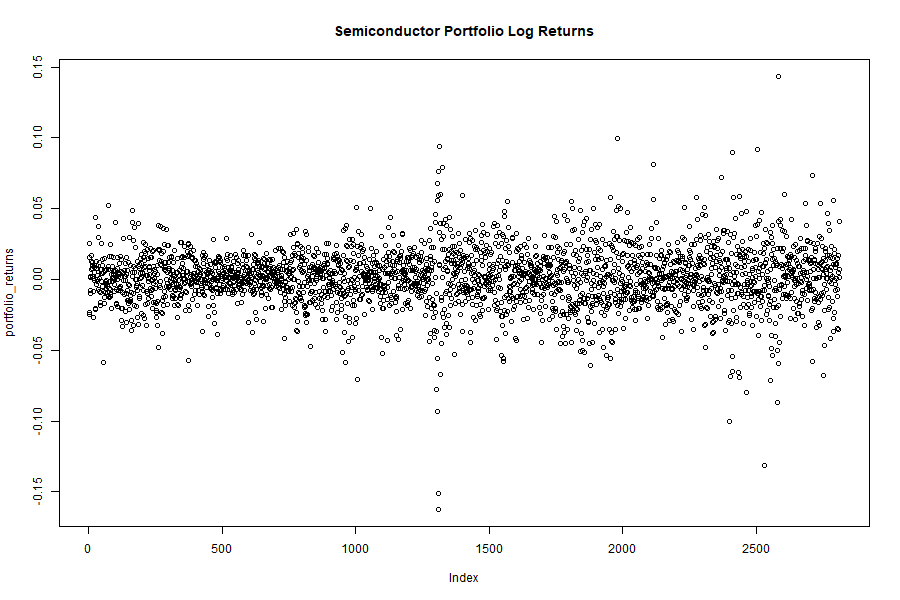
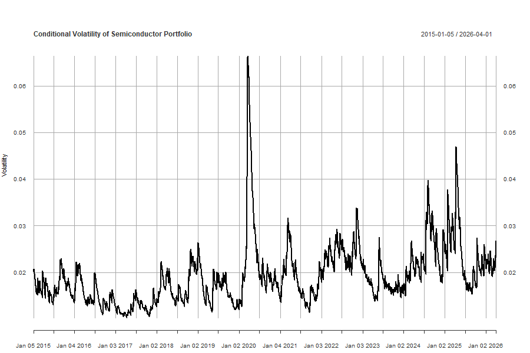
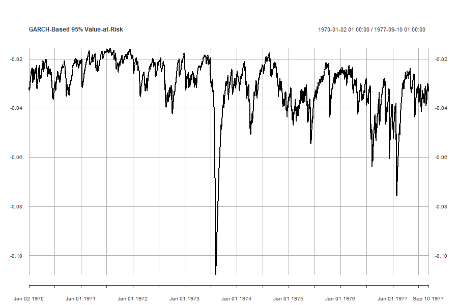

# Semiconductor Portfolio Risk Modelling Using GARCH-Based Value-at-Risk

## Abstract

This study investigates the volatility dynamics and downside risk of a semiconductor equity portfolio using GARCH to model volatility then using that volatility to compute Value-at-Risk (VaR). Financial return series are known to exhibit volatility clustering, persistence, and heavy tails, which violate classical assumptions of constant variance. To address this, a GARCH(1,1) model is employed to estimate time-varying conditional volatility and derive parametric VaR estimates. Empirical results show strong volatility persistence and time-varying risk, with estimated 95% VaR indicating approximately a 3% potential loss on extreme trading days.

## Introduction

This project applies a GARCH-based modelling framework to estimate conditional volatility and Value-at-Risk (VaR) for a semiconductor portfolio. The objective is to assess how risk evolves over time and evaluate the adequacy of volatility modelling in capturing market dynamics.

##  Data and Preprocessing

### Data Source

Daily adjusted closing prices were obtained from Yahoo Finance using the `quantmod` package in R.

The portfolio consists of:

* ASML Holding (ASML)
* Taiwan Semiconductor Manufacturing Company (TSM)
* Broadcom Inc. (AVGO)

# Methodology

###Volatility Modelling

To capture time-varying volatility, a standard GARCH(1,1) model is estimated:

σ_t² = ω + α ε_{t−1}² + β σ_{t−1}²

where:

* α (ARCH term) measures the impact of recent shocks
* β (GARCH term) captures volatility persistence

The model assumes normally distributed innovations.

###Value-at-Risk Estimation

Two VaR measures are computed:

#### Historical VaR

Empirical quantile of returns.

#### Parametric VaR (GARCH-based)

VaR_t = μ_t + z_{0.05} × σ_t

where:

* σ_t is conditional volatility from the GARCH model
* z_{0.05} is the 5% quantile of the standard normal distribution

##Empirical Results

###Value-at-Risk Estimates

* **Historical VaR (95%) ≈ −3.00%**
* **Parametric VaR (95%) ≈ −3.18%**

These results indicate that, with 95% confidence, the portfolio is expected to lose more than approximately 3% on the worst trading days.

###Volatility Persistence

The estimated GARCH parameters imply:

* α ≈ 0.059 → 5.9% of volatility driven by recent shocks
* β ≈ 0.912 → 91.2% driven by past volatility

Total persistence:

α + β ≈ 0.97

This indicates **high volatility persistence**, meaning shocks have long-lasting effects but eventually decay, consistent with financial theory.

### Volatility Dynamics

The conditional volatility series exhibits clear **volatility clustering**, where periods of high volatility are followed by further high volatility.

The most significant volatility spike occurs around 2020, corresponding to the COVID-19 market disruption. This reflects heightened uncertainty and increased market risk.

## Visual Analysis

### Portfolio Returns

The return series exhibits clear volatility clustering, with periods of low variability followed by clusters of large movements. This indicates the presence of conditional heteroskedasticity, violating the assumption of constant variance in classical models. Additionally, the presence of extreme returns suggests heavy tails, implying that large shocks occur more frequently than predicted by a normal distribution. Notably, a significant spike around 2020 reflects the impact of the COVID-19 market shock, indicating potential structural breaks in the volatility process.

### Conditional Volatility

The estimated conditional volatility series displays pronounced clustering, confirming the effectiveness of the GARCH(1,1) model in capturing time-varying risk. The persistence of volatility is high, with alpha + beta = 0.97, indicating that shocks to volatility decay slowly over time. Furthermore, the dominance of the GARCH term (beta = 0.912) over the ARCH term (alpha = 0.059) suggests that volatility is driven more by its own past values than by new shocks. The sharp spike in volatility during 2020, followed by gradual mean reversion, reflects the model’s ability to capture both sudden market stress and persistent risk dynamics.

### GARCH-Based Value-at-Risk

The Value-at-Risk estimates vary dynamically over time, reflecting changes in conditional volatility. Periods of elevated volatility correspond to increased VaR, indicating higher potential losses. This demonstrates the advantage of GARCH-based VaR over static risk measures, as it adapts to evolving market conditions. However, since VaR is directly driven by conditional volatility, it inherits its persistence and tends to react with a lag following sudden shocks. While the estimated 95% VaR suggests potential losses of approximately 3% on extreme trading days, proper validation through backtesting (e.g., exceedance frequency tests) is required to assess its accuracy.

## Discussion

The results confirm several well-documented stylised facts of financial returns:

* Volatility is not constant but time-varying
* Large shocks tend to cluster in time
* Volatility is highly persistent
* Risk increases significantly during periods of market stress

The GARCH framework successfully captures these dynamics, providing a more realistic measure of financial risk compared to static models.

However, the assumption of normally distributed errors may be restrictive, as financial returns often exhibit heavy tails. This may lead to underestimation of extreme risk.

## Limitations and Extensions

Several limitations are identified:

* Normal distribution assumption may underestimate tail risk
* No formal VaR backtesting performed
* Portfolio weights assumed static

Potential improvements include:

* Using Student-t or GED distributions
* Implementing VaR backtesting (Kupiec test)
* Extending to multivariate GARCH models

## Conclusion

This study demonstrates that GARCH-based models provide an effective framework for modelling financial volatility and estimating Value-at-Risk. The empirical results highlight the presence of volatility clustering and persistence in semiconductor equity returns.

The estimated VaR indicates that the portfolio is exposed to approximately 3% daily downside risk at the 95% confidence level, with risk increasing substantially during periods of market stress.

